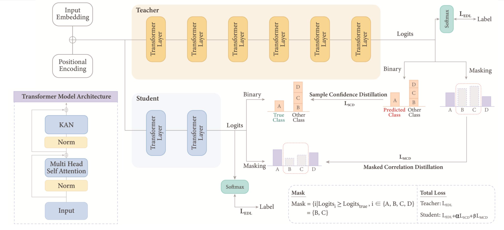

# KAN-Enhanced Knowledge Distillation for Lightweight Early IDS

This project introduces a lightweight early intrusion detection system that combines **Kolmogorov-Arnold Networks (KAN)** and **Knowledge Distillation** to proactively defend against security threats in IoT environments.

## 🏗 System Architecture

The system is designed to transfer knowledge from a high-performance Teacher model to a lightweight Student model, ensuring robust security performance even on low-spec edge devices.

### 1. Model Structure

* **Backbone:** Utilizes a Transformer architecture with a **Linear Attention** mechanism to maximize computational efficiency.
* **KAN (Kolmogorov-Arnold Networks):** Replaces the MLP layers in the Teacher model with KAN to learn complex attack patterns precisely with fewer parameters.
* **Input Layer:** Preserves packet characteristics using a **514-dimensional** input vector, reflecting the weighted average length of L4 headers and payloads.

### 2. Knowledge Distillation
* **MCD (Masked Correlation Distillation):** Learns the correlations between classes predicted by the Teacher model while masking incorrect prediction noise to provide refined knowledge to the Student.
* **SCD (Sample Confidence Distillation):** Uses the Teacher's confidence levels for each sample as a learning index to enhance the Student model's prediction stability.

### 3. Optimization & Loss
* **Early Detection Loss (EDL):** Forces early detection by assigning higher weights to accurate predictions made at shorter packet sequences.
* **Lightweight Optimization:** After training, **Static Quantization** is applied to compress the model size to approximately 500KB, minimizing real-time inference latency.

## 📊 Key Performance
* **Early Detection:** Successfully identifies the presence of an attack using an **average of only 7 packets**.
* **Lightweight Efficiency:** Successfully runs in real-time on a **Raspberry Pi Zero 2 W** with a model compressed by approximately **3x** compared to the original.
* **Explainability:** Provides an interpretive basis for predictions by analyzing **Attention Maps** to reveal which packet features the model focused on.
